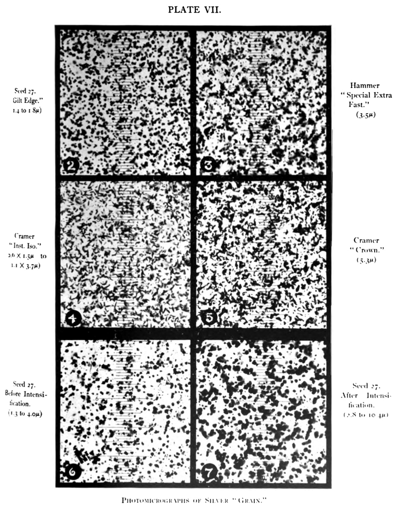
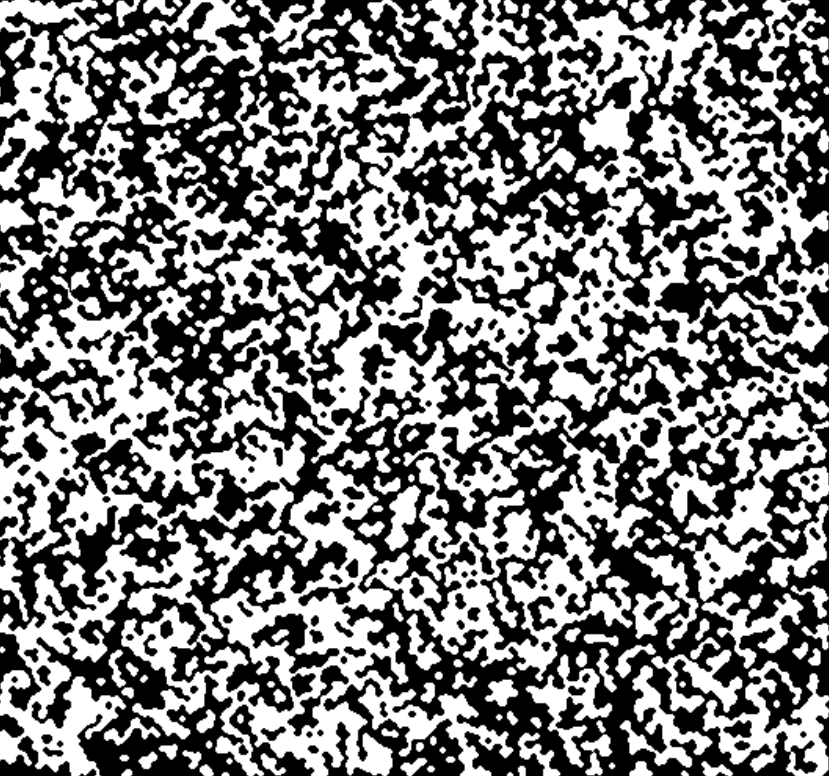

# Cellular Automata Film Grain

In this project I aim to simulate film grain in images using cellular automata.

This is an image taken from [wikipedia](https://en.wikipedia.org/wiki/Film_grain):

This is an image I was able to produce using cellular automata which seems similar to the microstructure of film grain:

Right now, aside from the performance issues, I can't find any cellular automata rules that preserve the ratio of bright and dark pixels for all ratios of the regions in an image.

This may be remediable using photo manipulations like normalisation or something.
